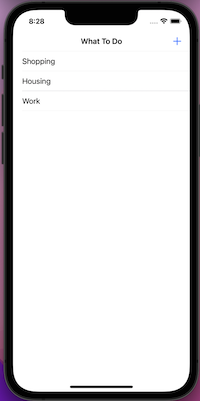
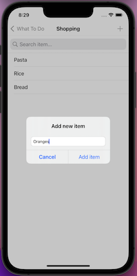
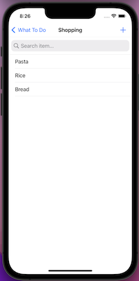
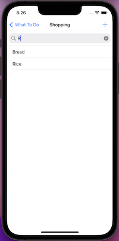

#  WhatToDo

<h4 align="center">A iOS ToDo List app</h4>

  •<a href="#key-features">Key Features</a>
  •<a href="#how-to-use">How To Use</a> 

## Code Quality Status
 
 
 
 
  

## Key Features

* UIKit
* MVC
* Structs
* Classes
* Optionals
* Extensions
* Closures
* Error handling
* TableView
* CoreData

## How To Use
The app allow you create a ToDo lists organized by categories